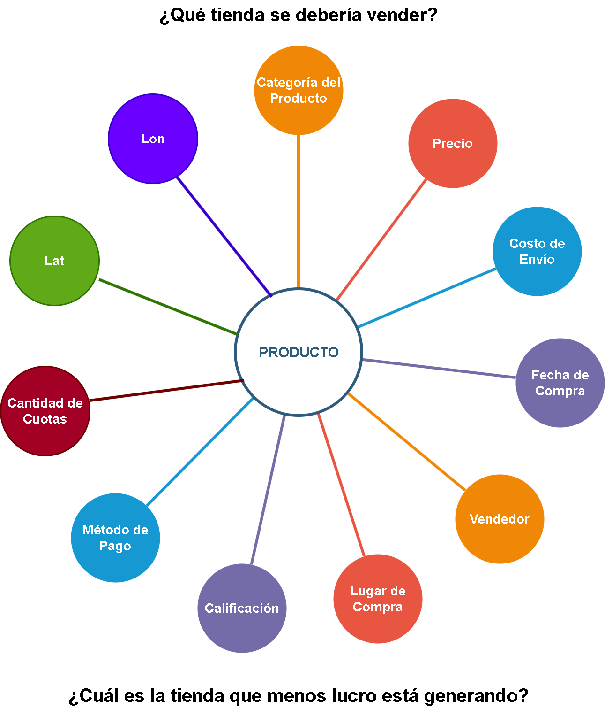
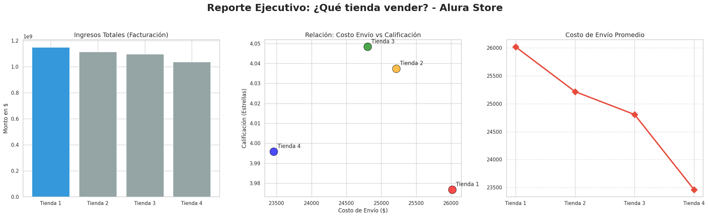

# 📊 Análisis de Optimización de Ventas: Alura Store

## 📝 Descripción del Proyecto
Este proyecto consiste en un análisis de datos profundo para la toma de decisiones estratégicas en una cadena de tiendas retail ("Alura Store"). El objetivo principal fue identificar cuál de las cuatro sucursales actuales debería ser vendida, basándose en criterios de rentabilidad, eficiencia logística y satisfacción del cliente.

## 🏗️ Estructura de los Datos
Para entender la base de nuestro análisis, a continuación se presenta el esquema de las variables procesadas en cada dataset:

## 🛠️ Tecnologías Utilizadas
* **Python 3.x**
* **Pandas:** Procesamiento y limpieza de datos.
* **Matplotlib & Seaborn:** Visualización de datos avanzada.
* **Folium:** Análisis geoespacial interactivo.
* **Google Colab:** Entorno de desarrollo.

## 📈 Hallazgos Clave (Insights)
1. **Tienda 1:** Mayor facturación bruta, pero con los costos de envío más altos y la peor calificación promedio del cliente (3.97).
2. **Tienda 3:** Sucursal con mayor fidelización y satisfacción del cliente.
3. **Logística:** Se identificó una correlación directa entre los altos costos de envío y la baja satisfacción en productos de la categoría "Muebles".

## 📈 Visualizaciones Destacadas
El análisis se apoyó en un dashboard integral que revela la desconexión entre el volumen de ingresos y la eficiencia operativa en puntos críticos de la cadena.

## 💡 Conclusión 

Tras el análisis, la recomendación profesional para el Sr. Juan es la **venta de la Tienda 1**.

### **Justificación del Veredicto:**
1. **El "Falso Positivo" de los Ingresos:** Aunque la Tienda 1 genera la mayor facturación bruta, su modelo es ineficiente. El alto volumen de ventas no se traduce en salud operativa.
2. **Logística Crítica:** Presenta el costo de envío promedio más alto del grupo ($26,018). Dado que el cliente absorbe este gasto, la tienda pierde competitividad frente a opciones más económicas.
3. **Reputación en Riesgo:** Es la sucursal con la calificación más baja (3.97). Los datos muestran que el elevado costo de envío y la gestión de categorías pesadas (Muebles) están afectando directamente la percepción de la marca.
4. **Costo de Oportunidad:** Mientras la Tienda 1 lucha con ineficiencias, la **Tienda 4** demuestra que es posible mantener costos bajos y la **Tienda 3** lidera en satisfacción. Vender la Tienda 1 permitiría reinvertir capital en estas sucursales de alto rendimiento.

## 🚀 Cómo ejecutar el proyecto
1. Clonar este repositorio o cargar el archivo `.ipynb` en [Google Colab](https://colab.research.google.com/).
2. Asegurarse de tener los archivos de datos (`tienda1.csv`, `tienda2.csv`, etc.) en la carpeta raíz.
3. Ejecutar las celdas en orden secuencial.

